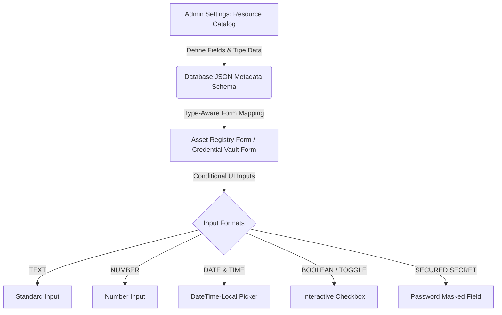

# Product Requirement Document (PRD)
## YATO Enterprise HRM: Schema-less Dynamic Catalog & Type-Aware Custom Field Engine

| Attribute | Details |
| :--- | :--- |
| **Document Title** | Product Requirement Document (PRD) - Dynamic Catalog & Asset/Credential Schema Engine |
| **Status** | Approved & Implemented |
| **Author** | Antigravity AI |
| **Target Version** | v2.4.0 (Enterprise Suite) |
| **Last Updated** | May 27, 2026 |

---

## 1. Product Overview & Objectives

### 1.1 Context
YATO Enterprise HRM relies heavily on physical asset tracking (servers, network switches, domains, laptops) and credential vaults (API keys, DB logins, cloud passwords). Traditionally, extending these models with custom fields required hardcoded database migrations, system downtime, and developer intervention. 

### 1.2 Objective
To solve this, we implemented a **Schema-less Dynamic Catalog & Custom Field Engine**. Administrators can configure catalog categories dynamically in the **Settings** menu and define arbitrary custom properties with distinct data validation formats. The system automatically adapts its input fields and display formatting without needing a single database migration.

### 1.3 Key Problems Solved
*   **Zero-Migration Extensibility:** No need to run DB migrations when a new department requires specific custom fields (e.g., adding "Rack Number" as a Number, or "Expiry Date" as a Date).
*   **Data Integrity & Validation:** Ensuring that user inputs are strongly typed (e.g., a user cannot type text inside a Date/Time field).
*   **Visual Professionalism:** Replacing boring raw JSON or text output with rich, beautiful status badges (e.g., YES/NO tags, password masked icons).

---

## 2. Core Features & Capabilities



### 2.1 Dynamic Field Formats (Format Selector)
The catalog editor supports five robust formats:
1.  **TEXT (Text):** For standard alphanumeric descriptions, hostnames, or names.
2.  **NUMBER (Number):** Restricts input to integers or floating numbers.
3.  **DATE & TIME (Date & Time):** Enforces a date-time format and triggers a calendar selector.
4.  **BOOLEAN / TOGGLE (Boolean):** Simple Yes/No toggle represented by beautiful checkboxes.
5.  **SECURED SECRET (Secured Secret):** Automatically masks secret codes behind dots (`••••••`) and offers visibility toggle eye icons.

### 2.2 Unified Catalog Editor
*   Located under `Settings` -> `Resource Catalogs`.
*   Includes **Edit** capabilities (pencil icons) for all existing catalog categories.
*   Enables dynamic adding, reordering, and removal of custom properties.
*   Allows marking fields as **Required** or **Optional**.

### 2.3 Type-Aware Rendering Engine
*   Renders correct input elements inside `assets/page.tsx` and `credentials/page.tsx` on-the-fly.
*   Converts user input types appropriately (e.g. converting numeric inputs to Float, dates to DateTime strings, and checkboxes to true Boolean values).

---

## 3. Technical Architecture & Database Design

### 3.1 Database Representation
We utilize PostgreSQL’s native **`Json`** data type in Prisma schema to hold schema specifications and runtime values:

```prisma
// Catalog Model (Schema Definition)
model Catalog {
  id        String   @id @default(uuid())
  name      String
  category  String   // e.g. "PHYSICAL_ASSET_TYPE", "CREDENTIAL_TYPE"
  metadata  Json     // Holds custom field schemas: [{ name: "Expired", type: "datetime", isRequired: true }]
}

// Asset Model (Runtime Storage)
model Asset {
  id        String   @id @default(uuid())
  assetCode String   @unique
  ownerId   String?
  metadata  Json?    // Holds runtime key-value map: { "Expired": "2026-06-27T02:50", "Status": true }
}
```

### 3.2 Backend Sanitation & Self-Healing
*   **Foreign Key Empty String Sanitizer:** Backend endpoints sanitize inputs like `ownerId`. When the owner selection is empty (`""`), it is converted to `null` to prevent foreign key constraint violations in PostgreSQL.
*   **Zero-Downtime Migration:** Fields can be added or updated without modifying database tables.

---

## 4. UI/UX Design System Guidelines

### 4.1 Form Inputs Rendering
To maintain a high-end look and feel, we use HSL custom palettes and rich styling:
*   **Boolean Checkbox:** Styled as a clean container:
    ```html
    bg-slate-50/50 border border-slate-100 rounded-xl px-4 py-3 hover:bg-slate-100/30
    ```
*   **Date-Time Local Picker:** Minimalistic calendar picker with styled focus borders (`focus:border-blue-500`).

### 4.2 Detail Modals Formatting
*   Boolean properties are automatically mapped to rich status badges:
    *   **YES:** `<span class="bg-emerald-50 text-emerald-600 border border-emerald-100">YES</span>`
    *   **NO:** `<span class="bg-slate-100 text-slate-500 border border-slate-200">NO</span>`

---

## 5. User Workflows

### 5.1 Workflow A: Configuring Custom Attributes
1.  Admin navigates to **Settings** -> **Resource Catalogs**.
2.  Clicks the **Edit** button next to a catalog item (e.g., `Domain Assets`).
3.  Clicks **+ Add Field**, names it `"Expired"`, selects **`DATE & TIME`** as the format, and ticks **`REQUIRED FIELD`**.
4.  Clicks **+ Save to Catalog**.

### 5.2 Workflow B: Registering an Asset with Format Validation
1.  Staff navigates to **Asset Registry** -> **Register Asset**.
2.  Selects `Domain Assets` as the asset type.
3.  The system dynamically pulls the schema and displays a **Calendar Picker** for `"Expired"`.
4.  Staff picks `27/06/2026 02.50` from the visual calendar and enters other details.
5.  Clicks **Generate Secure Identity Label**. Asset is saved successfully!

---

## 6. Security & Auditability
*   **Secure Secrets:** Passwords and tokens marked as `Secured Secret` are protected from shoulder-surfing with encrypted input masking.
*   **Relocation Ledger:** Relocations and status changes trigger an entry in `AssetMovement` for strict hardware audit trails.
