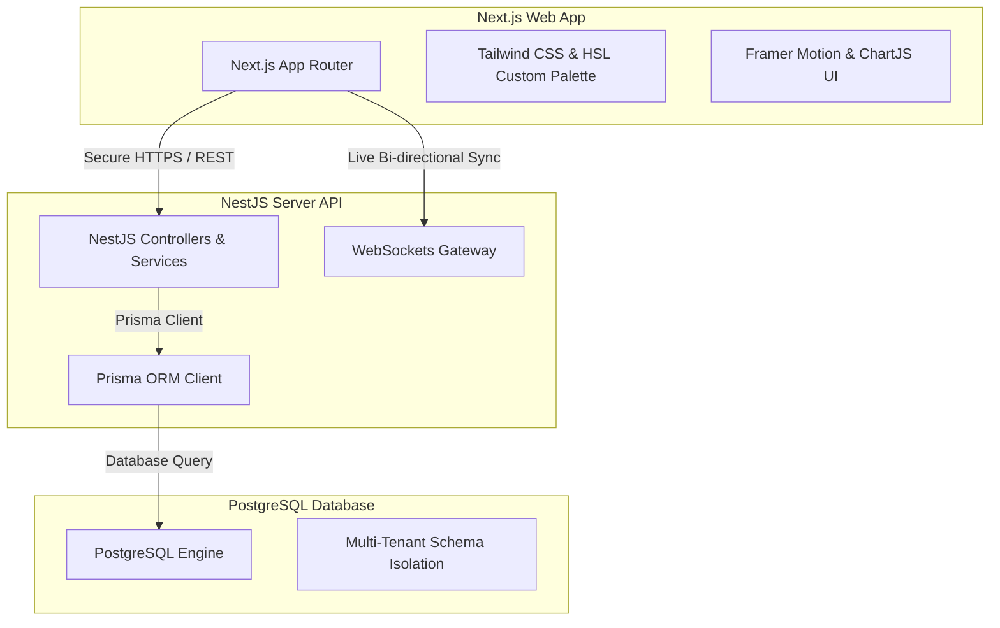

# Product Requirement Document (PRD)
## YATO Enterprise Suite: Integrated HRM & Infrastructure Orchestrator Platform

| Attribute | Details |
| :--- | :--- |
| **Document Title** | Product Requirement Document (PRD) - YATO Unified Enterprise Platform |
| **Product Version** | v2.5.0 (Enterprise Suite) |
| **Status** | Approved & Production Ready |
| **Author** | Antigravity AI |
| **Target Audience** | Stakeholders, Core Developers, IT Operations, HR Managers |
| **Last Updated** | May 27, 2026 |

---

## 1. Executive Summary & Product Vision

### 1.1 Context
In modern enterprises, there is a deep disconnect between **Human Resource Management (HRM)** and **IT Infrastructure / Datacenter Operations**. HR databases are isolated from the actual servers, credentials, VMs, and support requests managed by those same employees. This fragmentation leads to onboarding delays, security vulnerabilities, manual access control issues, and auditable compliance gaps.

### 1.2 Product Vision
**YATO Enterprise Suite** is a unified, next-generation platform that merges state-of-the-art **HRM Workflows** with **Datacenter Infrastructure Orchestration, CMDB tracking, Virtualization Request cycles, and a Secure Credential Vault**. By mapping employee identities directly to physical assets, cloud VMs, and access permissions, YATO provides unmatched efficiency, bulletproof security, and seamless auditability under a single premium dashboard.

---

## 2. Core Architecture & Tech Stack



### 2.1 Technology Stack
*   **Backend Server:** NestJS (TypeScript framework) supplying strict dependency injection, robust controllers, and modular services.
*   **Database ORM:** Prisma ORM for type-safe database queries and migration management.
*   **Database Engine:** PostgreSQL supporting native `Json` columns for dynamic schema-less fields.
*   **Frontend Client:** Next.js (App Router) using React Server Components, client-side React Query state caching, and responsive flex grid architectures.
*   **Real-time Layer:** Socket.io WebSockets for broadcasting server usage metrics, ticketing updates, and timesheet check-in alerts.
*   **Styling & Polish:** Vanilla CSS & Tailwind variables utilizing premium HSL color palettes, custom dark/light modes, micro-animations, and glassmorphism.

---

## 3. Module-by-Module Specifications

---

### 3.1 Module 1: Human Resource Management (HRM) & Advanced Timesheets

#### 3.1.1 Employee Profiles & Workspaces
*   **Requirements:** Store comprehensive employee files including full name, department, hierarchy roles, email, active phone numbers, and Telegram/WhatsApp notification links.
*   **Workspace Assignment:** Employees belong to designated physical branches or remote logical workspaces.

#### 3.1.2 Advanced Timesheet Management & Attendance Ledger
*   **Visual Monthly Calendar:** Beautiful calendar interface displaying current month timesheet entries.
*   **Quick Punch Engine:** Floating **Check-In** and **Check-Out** action triggers that capture exact network timestamp, location geofencing, and network IPs.
*   **Approval Workflows:**
    ```mermaid
    sequenceDiagram
        Employee->>Supervisor: Submit Overtime / Manual Clock Request
        Supervisor->>Department Head: Review & Validate Attendance
        Department Head->>Manager: Final Attendance Verification & Export to Payroll
    ```
*   **Payroll & Leave Integration:** Integrated approval forms for Leaves (sick leaves, paid time-off) that automatically recalculate net working hours in monthly timesheets.

---

### 3.2 Module 2: IT Asset Registry & CMDB Topology (Datacenter Orchestration)

#### 3.2.1 Schema-less Dynamic Catalog Engine
*   **Requirements:** Allow administrators to dynamically create categories (e.g., *Server Hardware, Switches, Office Laptops, Domain Names*).
*   **Format Type Selector:** Instead of writing database migrations, administrators can add custom properties with strict UI types:
    *   **`TEXT`:** Standard textual alphanumeric description.
    *   **`NUMBER`:** Numeric values with float restrictions.
    *   **`DATE & TIME`:** Enforces standard calendar/datetime-local browser inputs.
    *   **`BOOLEAN / TOGGLE`:** Rendered as clean, responsive checkboxes. Outputting true boolean states (`true`/`false`) in JSON metadata.
    *   **`SECURED SECRET`:** Masks sensitive codes (`••••••`) in forms.
*   **Type-Aware UI:** Custom inputs automatically map to type-safe visual inputs in frontend registries. Detail modals map boolean states to beautiful status badges (**`YES`** / **`NO`** tags).

#### 3.2.2 Datacenter Visual Rack Planner
*   Interactive rack alignment visuals displaying U-position slot distributions for physical servers.
*   Printable Zebra thermal label HTML markup with dynamic QR code integration containing rapid-scan asset tracking links.

#### 3.2.3 PandoraFMS & Prometheus Metrics Synchronization
*   Simulated cron-based collector syncing active performance parameters (CPU usage, Memory utilization, Uptime state, and relational metrics).
*   Automatic **HEALTHY**, **WARNING**, and **CRITICAL** health-status indicators mapping server health states.

---

### 3.3 Module 3: Secured Credential Vault

#### 3.3.1 Security Isolation & Identity Vaults
*   Stores corporate infrastructure credentials, access keys, SSL certificates, and database logins.
*   Restricts visibility of credentials based on Department and User RBAC permissions.

#### 3.3.2 Secret Protection Features
*   **Shoulder-Surfing Prevention:** Standard passwords and keys are heavily masked. Includes interactive password eye toggles (`Eye` / `EyeOff` icons).
*   **One-Click Copy:** Seamless copy-to-clipboard buttons with temporary visual feedback.

---

### 3.4 Module 4: Virtualization & Cloud Request Orchestrator

#### 3.4.1 VM Allocation Log
*   Tracks private virtualization hypervisors, resource pools, CPU/RAM allocations, and IP subnet mappings.

#### 3.4.2 Hardware Request Approval Workflows
*   Custom workflow engine where engineers request virtual machines or datacenter expansions.
*   **Tiered Approval Flow:** Passes through strict permission validation stages: **Supervisor Approval** $\rightarrow$ **Department Head Review** $\rightarrow$ **Datacenter Manager Provisioning**.

---

### 3.5 Module 5: Operations Ticketing & Service Request Engine

#### 3.5.1 Ticket Lifecycles
*   Enables employees to lodge IT issues, administrative inquiries, or equipment request tickets.
*   Supports Priority flags (Low, Medium, High, Emergency) and dynamic Category tags.

#### 3.5.2 Collaborative Timeline & Comments
*   Live audit trails showing assignment updates, status transitions, and collaborative discussion threads under each individual ticket workspace.

---

## 4. Security, RBAC, and Audit Trail Ledger

### 4.1 Role-Based Access Control (RBAC) Matrix
The platform defines multiple hierarchical user levels ensuring strict data boundaries:

| Role | HRM Modules | Asset Registry | Credential Vault | Ticket Operations |
| :--- | :--- | :--- | :--- | :--- |
| **Superadmin** | Read / Write (All) | Read / Write (All) | Read / Write (All) | Full Control |
| **Admin** | Read / Write (All) | Read / Write (All) | Read / Write (All) | Full Control |
| **Manager** | Approve Timesheets | View Only | View Only | View / Assign |
| **Supervisor** | Verify Timesheets | View Only | No Access | View / Resolve |
| **Employee / Staff**| Clock-In/Out, View Self | No Access | No Access | Create / Comment |

### 4.2 Immutable Audit Ledger
*   Every critical mutating action (CREATE, UPDATE, DELETE, EXPORT) is logged directly into the database.
*   Captures Actor ID, Action Tag (e.g., `CREATE_ASSET`, `DELETE_CREDENTIAL`), target Entity type, and key-value changes.
*   Audit trail outputs are accessible only by administrators and are immutable.

---

## 6. Integrations & Notification Core
*   **WhatsApp Gateway (WAHA):** Dynamic scheduling triggers warning notifications (e.g. H-3, H-1 before credential expiration or shift scheduling).
*   **Telegram Notification Webhooks:** Broadcasts emergency ticket failures directly to active IT alert channels.

---

## 7. Product Roadmap & Future Enhancements
1.  **AI-Powered Timesheet Analytics:** Identify abnormal overtime clocking or potential employee fatigue patterns.
2.  **Integrasi Proxmox/VMware API:** Transition VM requests from manual provisioning to direct Proxmox API orchestrator scripts.
3.  **Offline-First Clocking:** Mobile-friendly progressive web application (PWA) with local geocaching to allow timesheet check-ins even in areas with spotty network.
